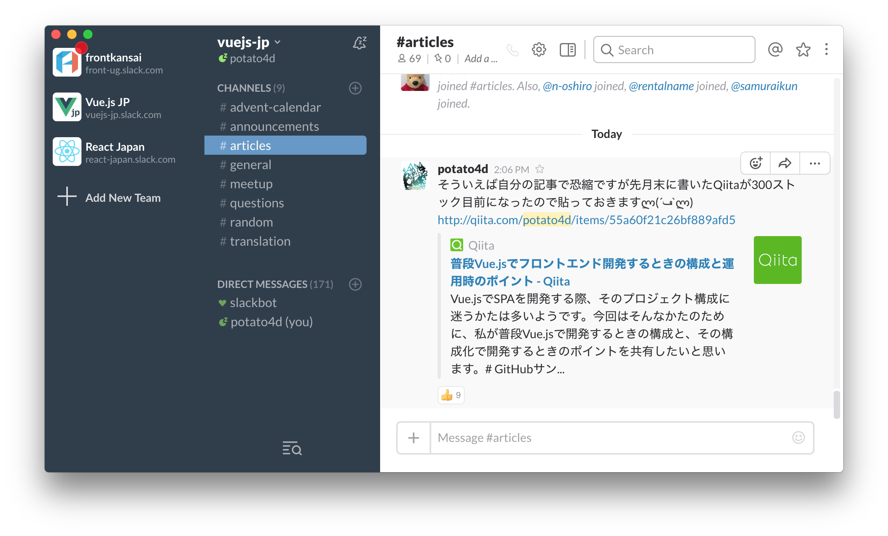

# Bonjiri

## Bonjiri is integrated management system for Slack on Electron.

## What's is this?

Bonjiri is an application for managing the Slack team beautifully and efficiently.
It works perfectly and lightly regardless of platforms such as Windows and macOS.

[https://potato4d.github.io/bonjiri](https://potato4d.github.io/bonjiri)
